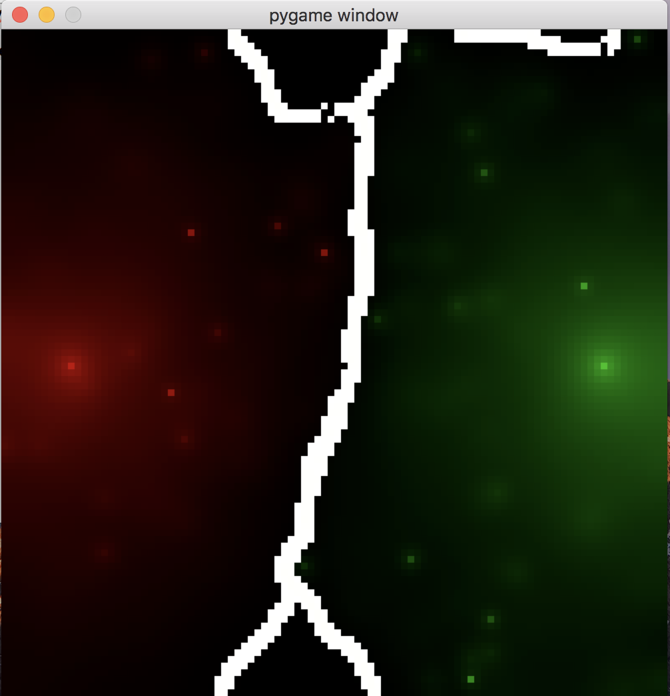

# Diffusion Game

Two players represented by red and green play the game on the board. Your "gas"/"bacteria colony"/"horde of zombies"/"what have you" diffuses throughout the board, and when red touches green they annhilate each other in proportion.

Bots designed to play this game generate a probability distribution for each timestep, given the state of the board as input. This probability distribution is used to randomly place packets of "gas"/"bacteria"/"zombies" on to the board. Points are won at each timestep for controlling area.

Mathematically:

Diffusion: dp/dt = D d^2p/dx^2

Score: integral Area dt

Reaction: R + G -> _

## To Run

Do something like

`python3 -i evolve.py`

and then

`>>> battle(0,1,True)`
